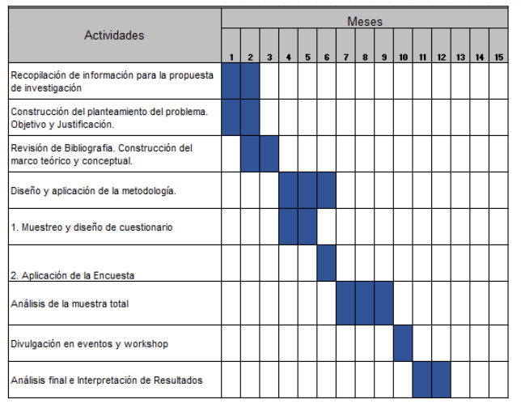

```{r setup, include=FALSE}
knitr::opts_chunk$set(echo = TRUE)
```

## SPSS
Primer paso, recodificar

cuantil: 

Tercil: dividir en tres partes la distribución.


Siempre fijarse en 
Categorías categórica.
En la ANOVA nunca tendrá todos los valores
Las muestras son independientes. En el caso de que sea normal, t-test. Si no es normal, U de Mann-Whitney


<br><br>



