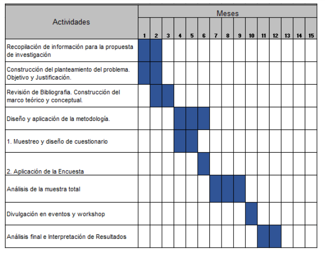

```{r setup, include=FALSE}
knitr::opts_chunk$set(echo = TRUE)

library(tidyverse)
library(eurostat)
library(knitr)
library(kableExtra)
library(data.table)
library(scales)
```

```{r, include=FALSE}
presupuesto = data.table(
  CA = c(
    "Personal",
    "Personal",
    "Personal",
    "Personal",
    "Personal",
    "Equipos",
    "Software (licencias)",
    "Materiales (bibliográficos, de oficina)",
    "Movilidad (viajes y alojamiento)",
    "Recogida de datos",
    "Procesado de datos",
    "Análisis de datos",
    "Costes de difusión (publicación de artículos, congresos científicos, creación de una web)",
    "Total"
  )
  ,
  c(
    "Investigador principal",
    "Analistas de datos",
    "Diseñador de la metodología",
    "Becarios predoctorales",
    "Encuestadores",
    "",
    "",
    "",
    "",
    "",
    "",
    "",
    "",
    ""
  ),
  CU = c(
    30000,
    21600,
    21600,
    14000,
    1000,
    2000,
    6000,
    700,
    10000,
    1,
    2240,
    1120,
    8000,
    NA
  ),
  UD = c(1, 2, 1, 1, 20, 5, 1, 1, 1, 10422, 1, 1, 1, NA),
  CT = c(
    30000,
    43200,
    21600,
    14000,
    20000,
    10000,
    6000,
    700,
    10000,
    10422,
    2240,
    1120,
    8000,
    177282
  ),
  JU = c(
    "Salario del personal investigador del proyecto.",
    "",
    "",
    "",
    "",
    "Se precisan equipos informáticos de alta calidad de operación, debido a la tipología del software y la información a procesar.",
    "Licencias: especialmente software de análisis de datos como SPSS.",
    "En todo proyecto hay una parte de consumo de material de papelería, tales como fotocopias, encuadernaciones, consumibles de ofimática, etc.",
    "Asistencia a congresos debido a la gran variedad de congresos existentes. Estancias cortas de investigación en centros de prestigio.",
    "Recogida de las encuestas y de todo tipo de datos necesarios para llevar a cabo el estudio de manera completa y pormenorizada.",
    "Los datos recogidos darán una idea de los datos obtenidos y toma de decisiones.",
    "Análisis en profundidad de los datos obtenidos y toma de decisiones.",
    "Publicaciones científicas. Cada vez hay mas revistas Open Access con una gran visibilidad e impacto. Inscripciones en los congresos nacionales e internacionales importantes.",
    ""
  )
)

# eda
presupuesto[, (c("CU", "CT")) := lapply(
  .SD,
  dollar,
  prefix = "",
  suffix = " €",
  big.mark = ".",
  decimal.mark = ","
), .SDcols = c("CU", "CT")]
presupuesto[, UD := comma(UD,
                          accuracy = 1,
                          big.mark = ".",
                          decimal.mark = ",")]
presupuesto[CU == "NA €", CU := ""]
presupuesto[UD == "NA", UD := ""]
```

# Resumen

Con el inicio de la industrialización se comenzó a producir una gran cantidad de alimentos nuevos, alimentos ultraprocesados, ¿pero realmente es bueno tomar dichos alimentos? En los últimos años, se ha producido un gran incremento de sobrepeso y obesidad en la población española ocasionada por el consumo de estos alimentos, lo que ha dado lugar a plantearse seriamente dicha pregunta. Además, como consecuencia de ello, se ha observado un gran incremento en el número de personas afectadas por enfermedades no transmisibles como la diabetes, enfermedades cardiovasculares, cáncer, entre muchas otras que se encuentran asociadas a su consumo. Ahora bien, ¿por qué surge este problema? ¿existe desconocimiento en la población española sobre lo que provoca el consumo de dichos alimentos? ¿qué explica el consumo de estos alimentos? En tal sentido, el objetivo será investigar sobre el consumo de ultraprocesados y como de informada está la población española sobre este tema y sus consecuencias, además de buscar la relación que existe con las enfermedades no transmisibles (ENT), para crear políticas públicas encaminadas a hacer frente a los efectos producidos por el consumo de alimentos ultraprocesados y, posteriormente, para concienciar e informar a la población española para contrarrestar las causas que incentivan su consumo.

# Antecedentes y estado actual del tema

En las últimas décadas, el aumento de la industrialización y los factores económicos, sociales y culturales han llevado consigo un incremento de la fabricación de productos ultraprocesados. Dichos productos se elaboran a partir de sustancias de otros alimentos o sintéticas  y ni en su composición ni en su presentación final se pueden identificar los ingredientes frescos. Los ingredientes que contienen estos alimentos  más comunes suelen ser el almidón, los azúcares añadidos, las harinas y aceites vegetales refinados y la sal. También están presentes en su composición variedad de aditivos industriales mencionados en la clasificación NOVA. 

La mayoría de los componentes de estos alimentos son pobres en nutrientes y altos en grasas saturadas y azúcares añadidos, además suelen ser muy densos en calorias. Este hecho junto con la inactividad física, el consumo de tabaco y alcohol, bebida considerada ultraprocesada, y los hábitos de vida poco saludables inducen a enfermedades crónicas no transmisibles, como enfermedades cardiovasculares, cáncer de colon, diabetes y enfermedades respiratorias.

Dicho lo anterior, uno de los principales factores que lleva al consumidor a incluir en su dieta los alimentos ultraprocesados es el ritmo de vida frenético al que está sometido. También se contempla la falta de conocimiento  que cierta población tiene sobre las sustancias perjudiciales que contienen y los procesos a los que están sometidos dichos alimentos. No podemos olvidarnos del sabor, otro factor importante que entra en juego y que provoca el consumo de estos alimentos, ya que debido a los procesos industriales a los que están sometidos adquieren un atractivo y un sabor llamativo.

Según los datos de la OMS, las enfermedades no transmisibles (ENT) terminan con la vida de 40 millones de personas cada año, correspondiente al 70% de la tasa de mortalidad mundial. Hay estudios que corroboran que estas muertes están relacionadas con el consumo de los alimentos ultraprocesados.

# Objetivos

Revisando la literatura sobre los alimentos ultraprocesados, es importante seguir indagando sobre el desconocimiento y los efectos que el consumo de estos alimentos tiene en la población española y conocer las causas que (des)incentivan su consumo.

Los objetivos de la investigación son los siguientes:

* Explorar sobre los hábitos de consumo de alimentos ultra-procesados en la población española.
* Investigar si la población española conoce los efectos que produce en la salud el consumo de alimentos ultra-procesados.
* Establecer si existe o no asociación entre el consumo de ultra-procesados, los problemas de salud y su tasa de mortalidad.

# Justificación de la investigación

Según los datos del Eurostat sobre el índice de masa corporal de 2008 a 2014 de diversos países de la UE, los jóvenes de entre 18 y 24 años de edad fueron el grupo que más incremento su IMC. Aunque el IMC no refleja realmente la proporción de grasa corporal contra musculatura, es más probable encontrar gente con sobrepeso real. Por ello, queremos investigar el consumo de alimentos ultraprocesados y sus posibles repercusiones sobre la salud.

# Metodología

Para el desarrollo del primero de los objetivos se aplicará una encuesta que contendrá una batería de preguntas que permita identificar cuáles son los alimentos básicos que consume frecuentemente la población española.\par
En el mismo sentido, para el desarrollo del segundo de los objetivos determinados para la investigación, la referida encuesta contendrá un conjunto de preguntas que permitirá identificar si los españoles conocen o no los efectos que produce el consumo de alimentos ultraprocesados en la salud.\par
Para el desarrollo del tercero de los objetivos, se analizará si el conjunto de variables surgidos de la encuesta —variables independientes— influyen en el consumo de alimentos ultraprocesados y la tasa de mortalidad —variables dependientes—. Para tal propósito, se efectuará el análisis de la regresión lineal múltiple.\par
Los resultados permitirán identificar si existe una relación causal entre las variables independientes y la variables dependientes y, de ser el caso, explicar nuestro objeto de estudio.\par

# Hipótesis iniciales

En concordancia con las preguntas y los objetivos de la investigación, las hipótesis de la investigación son las siguientes:

La primera de las hipótesis del presente estudio es que el hábito de consumo de alimentos ultraprocesados en la población española va en aumento en los últimos años.

La segunda de las hipótesis es que los españoles no conocen los efectos que el consumo de alimentos ultraprocesados produce en su salud.

La tercera de las hipótesis es que existe una relación causal entre el consumo de estos alimentos y las enfermedades crónico degenerativas y la tasa de mortalidad en la población española.

## Definición de la muestra y tipo de muestreo

La muestra será obtenida a partir de la población general de España a partir de 20 hasta 69 años, la cual, según el Instituto Nacional de Estadística, se compone de 39.788.083 habitantes. Se usará un muestreo estratificado por cuotas en el que distinguiremos dentro de cada comunidad autónoma diferentes grupos etarios mediante afijación proporcional. Se realizará el estudio asumiendo un 4% de error de estimación global y buscando como nivel de confianza o de fiabilidad un 95%.

Las variables por considerar se comprenden de la siguiente manera: las identificadoras se conforman por el sexo, grupo etario y la comunidad autónoma a la que los respondientes pertenecen; luego, se medirá el conocimiento de los alimentos ultra-procesados mediante un set de imágenes de alimentos en que los respondientes deberán señalar aquellos que consideran ultra-procesados; los hábitos alimenticios se medirán con la frecuencia auto reportada con la que los respondientes consumen cada elemento de los alimentos previamente señalados y qué tanto considera que su dieta es sana; finalmente, se identificará el conocimiento de las consecuencias sobre la salud al consumir productos ultra-procesados. La estructura del instrumento de medición tendrá la siguiente forma:

```{r, include=FALSE}
instr = data.table(
  Rubro = c(
    "Identificadoras",
    "Identificadoras",
    "Identificadoras",
    "Hábitos alimenticios",
    "Conocimiento del tema",
    "Conocimiento del tema",
    "Conocimiento del tema"
  ),
  Descripción = c(
    "Sexo",
    "Grupo etario",
    "Comunidad autónoma",
    "Frecuencia con la que consume cada alimento. La lista comprenderá grupos de tipo de alimentos (cárnicos, lácteos, alcohol, etc.).",
    "Identifique cuál de los siguientes alimentos son ultra-procesados.",
    "Considera que su dieta es sana",
    "Conoce las consecuencias sobre la salud al consumir productos ultra-procesados"
  ),
  Tipo = c(
    "Nominal",
    "Ordinal",
    "Nominal",
    "Dicotómica",
    "Escala",
    "Escala",
    "Dicotómica"
  )
)


```

```{r, echo=FALSE}
kable(instr, "latex", booktabs = T, caption = "Estructura del instrumento de medición sobre el desconocimiento de los alimentos ultra-procesados y sus repercusiones en la salud.") %>%
  collapse_rows(columns = 1) %>% 
  kable_styling(position = "center", latex_options = "HOLD_position", full_width = TRUE)
```

\pagebreak
# Cronograma

Se contempla que para llevar a cabo esta investigación tomará un total de 12 meses, realizándose en diversas etapas, cuyo cuadro se muestra en los anexos.

```{r, echo=FALSE, out.width="90%", fig.align="center", fig.pos="H", fig.cap="Cronograma de investigación."}

```

\pagebreak
# Presupuesto

Podemos visualizar el presupuesto en la tabla siguiente:


```{r presupuesto, echo=FALSE}
kable(
  presupuesto,
  "latex",
  booktabs = T,
  align = c("l", "l", "r", "r", "r", "l"),
  col.names = c(
    "Categoría",
    "",
    "Costes unitarios",
    "Unidades",
    "Costes totales",
    "Justificación de uso"
  ),
  caption = "Presupuesto del protocolo de investigación"
) %>%
  kable_styling(position = "center",
                latex_options = "HOLD_position",
                full_width = TRUE,
                font_size = 9) %>%
  column_spec(1, width = "1.2in") %>%
  column_spec(2, width = ".9in") %>%
  column_spec(3, width = "0.5in") %>%
  column_spec(4, width = "0.5in") %>%
  column_spec(5, width = "0.6in") %>% 
  collapse_rows(columns = c(1,6), valign = "top")
```


\begin{thebibliography}{99}
\bibitem{1} Fardet, A. (2019). Ultra-processed foods: A new holistic paradigm? Trends in Food Science \& Technology, 174-184.
\bibitem{2} Gómez, L. A. (2011). Las enfermedades cardiovasculares: un problema de salud pública y un reto global. Biomedica.
\bibitem{3} M.Powell, L. (2019). The price of ultra-processed foods and beverages and adult body wight: Evidence from U.S. veterans. Economic\& Human Biology, 39-48.
\bibitem{4} P.Buckley, J. (2019). Ultra-processed food consumption and exposure to phthalates and bisphenols in the US Nationnal Health and Nutrition Examination Survey, 2013-2014. Enviornment International, 10.
\bibitem{5} Posada, S. M. (2018). Alimentos ultraprocesados: repercusiones sobre la salud. Publicaciones Didácticas, 547.
\bibitem{6} Steele, E. M. (2019). Dietary share of ultra-processed foods and metabolic syndrome in the US adult population. Preventive Medicine, 40-48.
\end{thebibliography}

\pagebreak
# Anexos


```{r, include = FALSE}
poblacion = fread("pob_edad_es.csv")
poblacion[, comunidad := stringr::str_to_title(comunidad, locale = "es")]

# Seleccionar edades de interés
pob = poblacion[!age %in% c(unique(age)[1:4], unique(age)[(21-6):21])]

pob_total = poblacion[!age %in% unique(age)[1:3], .(pob = sum(pob)), by = comunidad]

# Valor crítico de la distribución Normal estándar
z = 1.96

muestreo = function(N, error = E) round(N / (error^z * (N-1) + 1))
# Error global
E = 0.04

# Encuestas
pob_total = pob_total[, .(comunidad, pob, muestra = muestreo(pob))]

# Muestra con cuotas

# Sacar proporciones para cuotas
pob[, f := pob/sum(pob, na.rm = TRUE), by = comunidad]

muestra_pob = pob[pob_total[, .(comunidad, muestra)], on = "comunidad"]
muestra_pob[, cuota := round(muestra * f)]

# Cuotas por afijación proporcional
error_estrat = function(N, n, z_dn = z, p = 0.5, q = 0.5) {
  z_dn * sqrt( ((p*q)/n) * ((N-n)/(N-1)))
  }

muestra_pob[, error := error_estrat(pob, cuota)]


# Preparación de tablas para exportar

pob_total_reporte = rbind(pob_total, data.table(comunidad = "Total", pob = pob_total[, sum(pob)], muestra = pob_total[, sum(muestra)]))
pob_total_reporte[, (c("pob", "muestra")) := lapply(.SD, comma, big.mark = ".", decimal.mark = ","), .SDcols = c("pob", "muestra")]
pob_total_reporte = pob_total_reporte[, .(Comunidad = comunidad, Población = pob, Muestra = muestra)]

muestra_pob_reporte = muestra_pob[, .(comunidad, age, pob, f, muestra, cuota, error)]
# muestra_pob_reporte[, comunidad := paste0(comunidad, "\nn = ", muestra)]
muestra_pob_reporte[, (c("f", "error")) := lapply(.SD, percent, accuracy = 0.01), .SDcols = c("f", "error")]
muestra_pob_reporte[, (c("pob", "cuota")) := lapply(.SD, comma, big.mark = ".", decimal.mark = ","), .SDcols = c("pob", "cuota")]
muestra_pob_reporte = muestra_pob_reporte[, .(Comunidad = comunidad, Grupo_etario = age, Población = pob, Proporción = f, Cuota = cuota, Error = error)]

```

```{r, include=FALSE}
overweight = fread("data/overweight.csv")

overweight_fig = ggplot(overweight) +
  geom_segment(aes(
    x = `2008`,
    xend = `2014`,
    y = age,
    yend = age,
    colour = direction
  ),
  size = 1.5
  ) +
  geom_point(aes(x = `2008`, y = age, color = "2008"), size = 1, shape = "|") +
  geom_point(aes(x = `2014`, y = age, color = "2014"), size = 1, shape = "|") +
  scale_color_manual(values = c("#b2b2b2", "#323232", "#d8003d", "#00f2ad")) +
  guides(color = guide_legend(title = "Año")) +
  facet_wrap(vars(geo), ncol = 2) +
  theme_light(base_size = 10) +
  labs(
    x = "Porcentaje de la población con sobrepeso y obesidad",
    y = "Rangos de edad",
    caption = "Fuente: Datos de la Oficina Europea de Estadística."
  ) +
  theme(
    axis.title.y = element_blank(),
    panel.grid.major.y = element_blank(),
    panel.grid.minor.y = element_blank(),
    legend.position = "bottom",
    legend.direction = "horizontal",
    axis.title = element_text(size = 10),
    plot.caption = element_text(size = 10),
    strip.background = element_rect(fill = "White"),
    strip.text = element_text(colour = "black", size = 10)
  )
```

```{r, echo=FALSE, fig.width=9, fig.height=9, fig.pos="center", fig.cap="Porcentaje de la población con sobrepeso y obesidad de países de la Unión Europea de 2008 a 2014."}
overweight_fig
```


```{r pob_total, echo=FALSE, fig.pos="b"}
kable(
  pob_total_reporte,
  "latex",
  booktabs = T,
  align = c("l", "r", "r"),
  caption = "Tamaños de muestra estratificados por comunidades autónomas de España"
) %>%
  kable_styling(position = "center", latex_options = "hold_position")
```


```{r muestra_pob, echo=FALSE, fig.pos="b"}
kable(
  muestra_pob_reporte,
  "latex",
  longtable = T,
  booktabs = T,
  align = c("l", "l", "r", "r", "r", "r"),
  caption = "Cuotas por grupos de edad y errores."
) %>%
  collapse_rows(columns = 1:2, valign = "top") %>%
  kable_styling(latex_options = c("repeat_header", "hold_position"))
```
